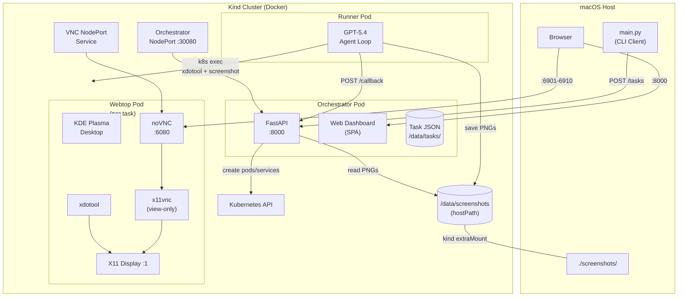
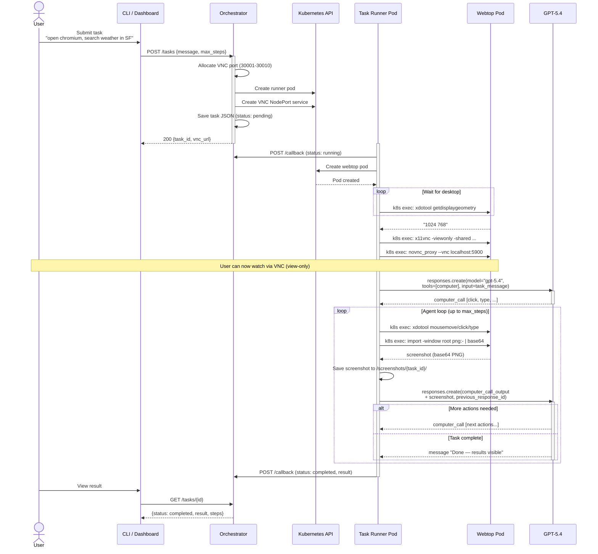
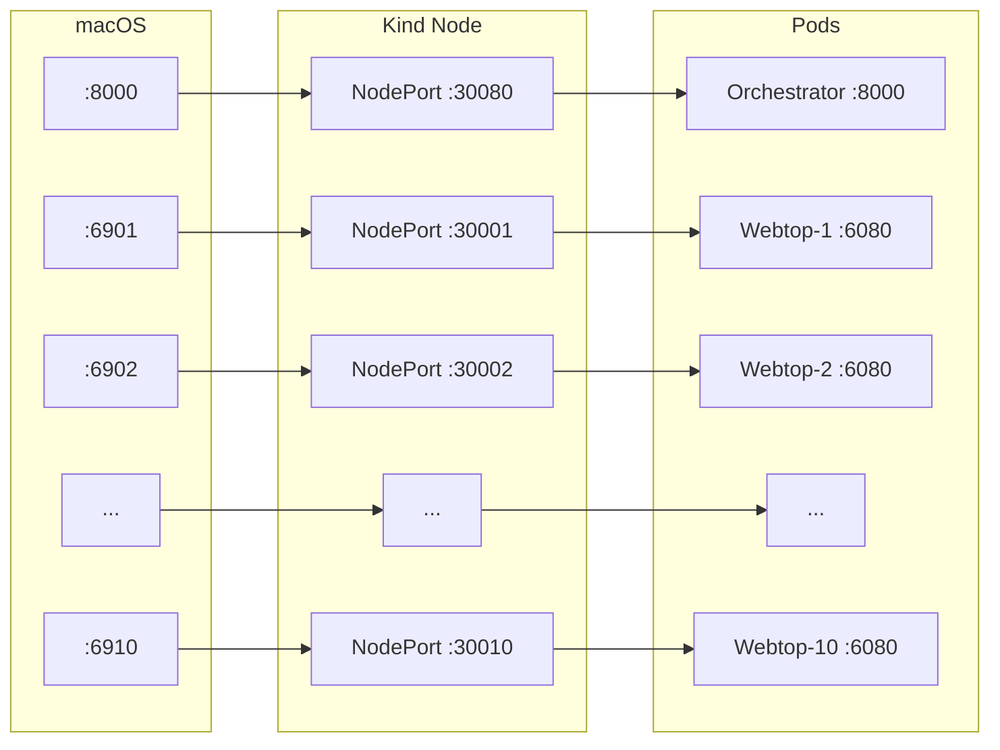
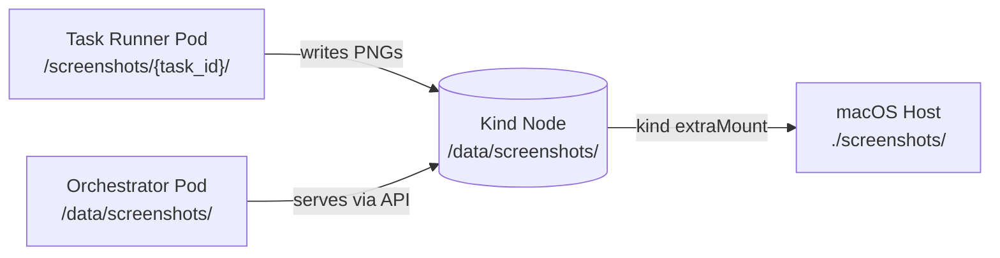
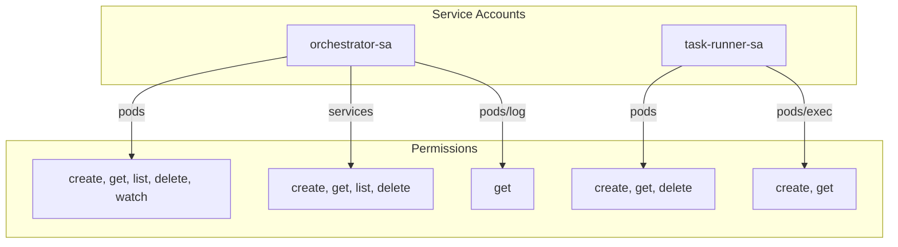
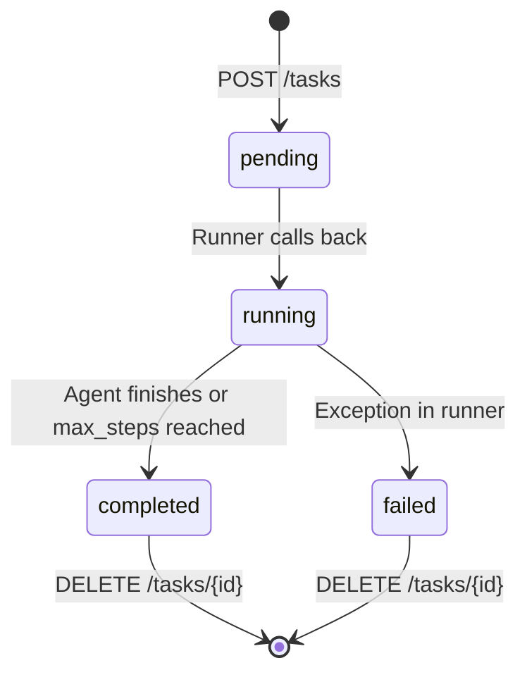

# CUA Task Orchestrator — Architecture

## High-Level Architecture



## Component Overview

| Component | Image | Role |
|---|---|---|
| **Orchestrator** | `python:3.12-slim` | REST API, dashboard, task lifecycle, k8s resource management |
| **Task Runner** | `python:3.12-slim` | Creates webtop pod, runs GPT-5.4 agent loop, captures screenshots |
| **Webtop** | `linuxserver/webtop:debian-kde` | KDE desktop with Chromium, xdotool, x11vnc, noVNC |

## Happy Path — Task Execution



## Networking



Port mapping chain: **macOS port** → kind `extraPortMappings` → **NodePort service** → **pod container port**

## Screenshot Persistence



Screenshots flow through a shared `hostPath` volume mounted into both the runner (write) and orchestrator (read/serve) pods, with kind's `extraMounts` syncing the node filesystem back to the macOS host.

## RBAC



The task-runner needs `get` on `pods/exec` because the Kubernetes Python client uses a websocket-based GET for `stream()`.

## Task Lifecycle



## Project Structure

```
clicks.trial.workday/
├── orchestrator/
│   ├── app.py                 # FastAPI orchestrator
│   ├── Dockerfile
│   ├── requirements.txt
│   └── static/index.html      # Web dashboard (SPA)
├── task-runner/
│   ├── runner.py              # Agent loop + webtop lifecycle
│   ├── Dockerfile
│   └── requirements.txt
├── webtop/
│   └── Dockerfile             # KDE desktop + chromium + xdotool + vnc
├── k8s/
│   ├── orchestrator.yaml      # Deployment + NodePort Service
│   └── rbac.yaml              # ServiceAccounts, Roles, RoleBindings
├── kind-config.yaml           # Cluster config (ports + mounts)
├── Taskfile.yml               # bootstrap-cluster, build, deploy, etc.
├── main.py                    # CLI client
└── docs/
    └── architecture.md        # This file
```
